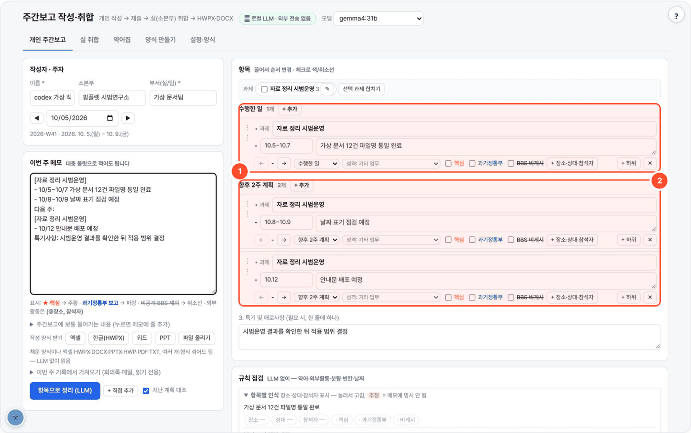

# weekly-local — 주간보고 작성·취합

> 이번 주 메모를 과제별 '수행한 일'과 '향후 2주 계획'으로 정리합니다. 항목을 고쳐 미리보고 제출하면 실 취합으로 이어지고, HWPX·DOCX·엑셀·PPT로 내보냅니다.



## 무엇을 하나

- 개인은 이번 주 메모를 대충 적으면 로컬 LLM이 주간보고 항목(수행한 일 / 향후 2주 계획, 분류, 외부활동 장소·참석자)으로 정리하고, 지난주 '향후 2주 계획'과 대조해 이월을 제안합니다.
- 실(소본부)은 제출된 개인 보고를 부서별 행의 표로 합치고(중복 합치기·간결화), 1쪽이 넘으면 압축합니다.
- 핵심=주황, 과기정통부 보고=파랑, BBS 비게시=취소선이 HWPX·DOCX에 그대로 들어가고, BBS 게시용(취소선 항목 제외)을 따로 내보냅니다.
- 약어는 사내·시드(원자력·기관·AI·컴퓨터) 약어집으로 첫 등장에 독자 수준(분야별 1~3)에 맞춰 풀고, **모르는 약어는 지어내지 않고 작성자에게 묻습니다**(답하기 전 제출 차단).
- LLM 뒤에 숫자·장소·참석자를 메모 원문과 결정론으로 대조합니다. 로컬 LLM만 쓰고, 표준 라이브러리만(설치 없음).

## 사용 방법

화면의 번호: **①** 수행업무(완료한 일의 과제명·기간·문장 확인) · **②** 향후 계획(예정된 일을 고치고 날짜와 보고 기간 확인)

1. **작성자·주차와 메모를 적는다** — `[과제명]` 아래 업무와 날짜를 씁니다. 다음 주 계획, 핵심·과기정통부·비공개 표시도 메모에 넣습니다.
2. **항목 정리 후 점검한다 (① ②)** — `항목으로 정리 (LLM)`을 누르고 과제명·기간·문장을 확인합니다. 약어와 추정값은 확인 카드에서 답합니다.
3. **미리보고 제출·내보낸다** — 개인 보고를 저장해 실 취합에 반영하거나 HWPX·DOCX·엑셀·PPT로 받습니다. BBS 게시용은 비게시 항목을 제외합니다.

## 예시

가상 자료로 실제 돌린 결과입니다(위 화면).

입력(이번 주 메모):

```text
[자료 정리 시범운영]
- 10/5~10/7 가상 문서 12건 파일명 통일 완료
- 10/8~10/9 날짜 표기 점검 예정
다음 주:
[자료 정리 시범운영]
- 10/12 안내문 배포 예정
특기사항: 시범운영 결과를 확인한 뒤 적용 범위 결정
```

출력(항목 정리 결과 · 개인 보고):

```text
수행 · 10.5~10.7   가상 문서 12건 파일명 통일 완료
계획 · 10.8~10.9   날짜 표기 점검 예정
계획 · 10.12       안내문 배포 예정
특기사항: 시범운영 결과를 확인한 뒤 적용 범위 결정
```

> 이 결과는 10.8~10.9 예정 업무도 향후 계획으로 분류했습니다. 표의 보고 기간에 맞춰 조정하세요. 모르는 약어·과제명은 확인 후 제출하며, 1쪽 분량은 추정입니다.

## 설치·실행

```bash
bash setup.sh                 # Python → LLM 서버 탐색 → selftest → http://localhost:8788
bash setup.sh stop
python3 app.py                # 수동 실행
python3 app.py --cli itemize < memo.txt     # 메모 → 항목 (표준 출력)
python3 selftest.py           # 가짜 LLM 으로 검증 (WORKSPACE 를 임시 폴더로 바꿔 돌고 지움)
python3 glossary/build_nureg.py             # NUREG-0544 원본 HTML 을 다시 파싱
python3 glossary/build_nist.py              # NIST CSRC Glossary 내보내기 zip 을 다시 파싱
```

[agent-page-portal](https://github.com/gggg8657/agent-page-portal)에서 띄우면 포털이 포트(8788)·`WORKSPACE`·`AGENT_DATA`·LLM 설정(로컬 Ollama `gemma4:31b`)을 넣어 줍니다.

| 환경변수 | 기본 | 설명 |
|---|---|---|
| `PORT` | `8788` | 0.0.0.0 에 뜸 |
| `WORKSPACE` | `./_workspace` | `reports/<주차>/<사람>.json` 개인 제출본(미확인 약어·사유 포함), `agg/<주차>/<소본부>.json` 취합본(질의 메모 포함), `orgs.json` 소본부·부서, `glossary.json` 사내 약어집(이력), `glossary_ignore.json` |
| `AGENT_DATA` | WORKSPACE 의 상위 | 같은 서버 다른 도구(meeting-local 회의록, mail-local 메일 이력)를 **읽기만** 해서 '기록에서 가져오기'에 보여 줌. 없으면 그 기능이 숨겨짐 |
| `LLM_API` / `LLM_BASE_URL` / `LLM_MODEL` | `ollama` / `http://localhost:11434` / `qwen3:8b` | 포털 실행 시 로컬 Ollama `gemma4:31b`. OpenAI 호환 서버면 `LLM_API=openai` |
| `LLM_API_KEY` | (없음) | OpenAI 호환 서버용(선택) |
| `NUM_CTX` | `16384` | Ollama 컨텍스트 |
| `KORDOC_CLI` | `../kordoc-local/node_modules/kordoc/dist/cli.js` | 있으면 'HWPX 검증' 버튼이 `kordoc validate` + 다시 읽기로 확인 |

## 흐름
**개인 주간보고** — 이름·소본부·부서·주차(월~금) → 메모(★/핵심, 과기정통부 보고, 비공개, `(@장소, 참석자)` 를 적으면 표시까지 잡음) →
`항목으로 정리` → 항목별 편집(끌어서 순서, 수행/계획, 분류, 핵심·과기정통부·BBS 비게시 체크, 장소·참석자) → 규칙 점검 → 미리보기 → `제출`.
지난 제출본의 '향후 2주 계획'을 번호로 LLM 에 주고 완료/진행/미착수/미확인과 근거 구절을 받습니다(근거가 메모에 없으면 '미확인'). 완료 아닌 것은 `이월` 버튼으로 이번 계획에 추가.

**실 취합** — 주차·소본부 → 부서별 제출 현황(설정에 등록한 부서 중 미제출 빨강) → `취합` (부서마다 LLM 1회: 같은 일 합치기, a→b→c→기타 순, 간결화) →
부서별 행 편집 → 분량 막대(1쪽 추정) → 넘으면 `압축` → HWPX/DOCX/HTML/텍스트, BBS 게시용.

## LLM 이 지어내지 않게 (결정론 검사)
- 항목마다 원문(메모 + 가져온 기록 + 지난 계획)과 비교: 원문에 없는 **숫자·영문 표기**는 ⚠ 표시, 원문에 없는 **장소·참석자**는 지우고 ⚠.
- 취합: 표시(핵심·과기정통부·비게시)와 장소·참석자는 LLM 이 아니라 원래 항목에서 OR/합집합으로 모읍니다. LLM 이 빠뜨린 항목은 **원문 그대로 복원**.
  게시/비게시가 섞여 합쳐지면 비게시(취소선)로 두고 알림.
- 압축: 핵심·과기정통부 항목은 지우지 않음(LLM 이 지우라 해도 유지), 원문과 숫자가 달라진 고쳐쓰기는 반영 안 함, 뺀 항목은 '되살리기' 가능.

## 표시·장소·상대·참석자 — 메모 줄 대조 (LLM 뒤 결정론, `rules.apply_source`)
항목마다 그 항목이 나온 메모 줄(글자 2-gram 겹침이 가장 큰 줄)을 찾아 LLM 결과를 고칩니다.
- **과기정통부(파랑)는 명시 표시만**: `(과기정통부 보고)` · `과기정통부 보고:` · `장관 보고 사항` · `#과기정통부`, 화면 체크, 엑셀·양식의 과기정통부 칸.
  과기정통부·장관·MSIT 를 **언급만** 하거나 과기정통부가 요청한 일은 파랑을 끄고 **'과기정통부 보고 사항인가요? [예][아니오]'** 카드로 묻습니다(답할 때까지 표시 안 함, 제출은 막지 않음).
- **핵심(주황)도 명시 표시만**: `★` · `(핵심)` · `핵심:` · `(중요)` · `#핵심`. 표시 없이 LLM 이 핵심으로 본 것은 같은 질문 카드로.
- **사람은 세 칸**: 장소 / **상대**(상대 기관·외부 인물 — 문장에 남김) / **참석자**(우리 연구원 사람만). 공식 표기 `(@장소, 참석자)` 에는 장소·참석자만.
  참석자 칸에 들어온 `과기정통부 김사무관`·`KINS 담당자`·`이교수님`(외부 직함·기관 이름)은 상대로 옮기고, 문장에 없으면 넣습니다
  (`과기정통부 사업 진도 점검 회의` → `과기정통부 김사무관과 사업 진도 점검 회의 (@세종 정부청사, 홍길동, 박책임)`). LLM 이 상대로 둔 `서박사`·`박책임` 같은 우리 쪽 직함은 참석자로.
- **작성자 자동 포함**(설정, 기본 예): 장소가 있는 외부활동에 작성자가 갔으면(동행·함께·발표 등, 다른 사람이 주어이거나 '대리'면 아님) 참석자 앞에 작성자. 이미 있으면 다시 안 씀. 메모에 `(@장소, 참석자)` 를 직접 적었으면 그대로.
- **온라인**: 화상·온라인·비대면·웨비나(그리고 외부 상대가 있는 전화·메일) → 장소 `온라인`(설정 '온라인 표기': `@온라인` / 생략). 장소 없음 경고를 내지 않습니다.
- **장소 없는 `(이름)` 은 쓰지 않습니다** — 공식 표기는 늘 `(@장소, 참석자)`. 문장에 장소 이름이 있어도(`KAIST 이교수 연구실 방문`) `(@KAIST, 홍길동)`. 장소가 없으면 규칙 점검이 묻습니다.
- `김선임 대신 내가 감` → 작성자만 참석(김선임 뺌), `(@창원 CECO, 이연구 수상, 나는 공저자)` → 작성자도 참석자.
- **계획 칸인데 '이미 …완료됨·끝남·서명 완료'** → '이미 끝난 일인가요? 수행으로 옮길까요?' 카드(예 = 수행으로, 하위 항목도 같이).
- '(비공개)' 상위 항목의 하위 항목도 비게시. 날짜는 기간 칸으로만(`(10/20 본관)` → 기간 10.20, 문장엔 '본관'), `10/14-17` 의 17 도 원문 날짜로 봅니다.
- **연구원 안 장소**(본관·회의실·연구동 …)는 `(@…)` 대신 문장에 남깁니다(`연구원 본관 과기정통부 장관 현장 방문 대응 준비`).
- 화면 점검 칸의 **항목별 인식**: 항목마다 장소 / 상대 / 참석자 / 작성자 / 핵심 / 과기정통부 / 비게시 칩 — 한 번 눌러 고침(글 칸은 입력, 표시는 켜기/끄기).
  메모에 명시되지 않고 LLM·규칙으로 채운 칩은 **추정**, 답을 기다리는 표시는 **확인**. 항목 편집기에도 '상대' 칸이 있습니다.
- 취합: 상대·참석자는 합집합, 작성자 포함은 작성자 이름 목록으로 모읍니다.

## 규칙 점검 (LLM 없이)
| 규칙 | 방법 |
|---|---|
| 약어 풀이 | 대문자 2자 이상·영숫자(APR1400)·하이픈(MARS-KS, i-SMR)·슬래시(OECD/NEA) 토큰 검출(장소·참석자 칸 포함) → 약어집 조회(동음이의는 문맥) → 문서 **첫 등장**에 분야별 수준으로 `약어(풀이)` 병기. 이미 영문 전체 이름을 같이 쓴 곳(`ABC(두 단어 이상 영문)`·`Large Language Model(LLM)`)만 건너뜀 — `이상탐지(VAD)`·`오탐(FP)` 처럼 한글 뜻만 붙은 약어는 그대로 ※ 약어에 올림. 확정 못 하면 작성자 질의(아래) |
| 외부활동 | 참석·발표·출장·회의·방문·워크숍·학회·국제·세미나·포럼… 낱말(내부·실 회의·회의실 제외, 외부활동 아님으로 둔 연구원 안 장소 제외) 또는 LLM 이 외부로 표시한 항목에 장소·참석자(작성자 자동 포함 반영) 없으면 경고. 출력은 `내용 (@장소, 참석자)` — **외부활동에만** 붙임(연구원 안 장소·장소 없는 전화·메일·메신저는 내부로 보고 안 붙임), 문장에 이미 나온 이름·장소는 괄호에서 뺌. 설정 '참석자 표기': 외부활동만(기본) / 항상 / 안 함 |
| 분량 | 표 칸 폭·글자 수로 줄 수 추정 → 소본부 1쪽(기본 44줄) 넘으면 경고. 항목 110자 넘으면 경고 |
| 빈칸 | 빈 항목, 부서의 '수행한 일'·'향후 2주 계획' 칸이 비면 경고 |
| 날짜 | `10/15`·`2026-10-15`·`10월 15일`·`10. 15.` 이 섞이면 경고 → `날짜 통일` 버튼으로 `10. 15.(목)` 하나로 (요일은 프로그램이 계산) |

## 양식 만들기 — 과제 등록부
'양식 만들기' 탭: 소본부 → 실(→ 사람)마다 과제를 등록해 두면(`WORKSPACE/projects.json`, 실 전체가 같이 씀)
- 과제: 보고서에 쓰는 이름(예: 기본사업, i-SMR 과제), 정식 이름·코드(선택), 기본 기간(선택), 담당(실 전체 또는 한 사람), 사용 여부, 순서(끌어서)
- 추가·이름 바꾸기·지우기(되살리기 가능)·순서·**지난 제출에서 가져오기**(최근 4주 제출에서 쓴 과제명) — 로그인이 없으므로 고친 사람·때와 이력만 남깁니다
- 실 구성원 목록 → 사람마다 블록(한글·워드)·슬라이드(PPT)
작성 양식 만들기: 범위(이 실 / 소본부 전체), 사람별, 주차, 형식(엑셀·한글·워드·PPT), 미리보기. 활성 과제마다 두 표에 '∙ (과제명)' 과 빈 '- (기간) 내용' 한 줄
(기본 기간이 있으면 '- (기간) 내용' 대신 그 기간). 엑셀은 과제목록 시트·드롭다운이 등록부에서 오고, 사람·과제마다 한 줄을 미리 채울 수 있습니다.
등록부는 어디서나 씁니다: 과제명 질의 카드의 후보(등록 순서 먼저), 가져오기에서 등록 과제와 비슷한 이름(띄어쓰기·괄호·대소문자만 다르거나 아주 비슷)은
**제안만**(점검표에서 체크해야 바뀜), 보고서의 과제 순서는 등록부 순서.

**별칭·과제 합치기**
- 과제마다 **별칭**(쉼표, 예: 주간보고서 자동화 ← 주간보고서 봇)을 적어 두면 항목 정리·파일 가져오기·실 취합에서 LLM 없이 등록 이름으로 바꾸고 기록을 남깁니다(`과제명 '주간보고서 봇' → '주간보고서 자동화'(별칭)`). 별칭이 아닌 비슷한 이름은 바꾸지 않고 제안만 합니다.
- 실에 등록 과제가 있으면 항목 정리에서 LLM 이 **등록 과제(+별칭) 중에서만** 과제명을 고르고, 목록에 없는 이름을 내면 '등록되지 않은 과제명' 으로 표시합니다.
- 개인·취합 화면의 **과제 막대**: 과제 칩 ✎ 로 이름 바꾸기, 둘 이상 체크 → **선택 과제 합치기**(남길 이름 선택·새 이름, '앞으로도 이 이름은 합치기' 체크 시 별칭으로 저장).
- **합치기 제안**: 이름이 비슷하거나 핵심 낱말을 공유하는 과제 쌍을 찾아 LLM 이 같은 과제인지 예/아니오로 판단(LLM 이 안 되면 4자 이상 공통 낱말·포함 관계 규칙) → '같은 과제로 묶을까요? (A → B) [묶기] [따로 두기]'. 자동으로 합치지 않습니다. 남길 이름은 등록 과제 쪽 우선. '따로 두기' 는 실·쌍별로 기억(`WORKSPACE/merge_dismissed.json`).
  한글로 읽어 적은 영문 약자도 맞춰 봅니다(`아이에스엠알 과제` → `ISMR 과제` ≈ `i-SMR`, `projects.translit`). 제안은 과제 막대와 함께 **미리보기 맨 위**에도 모아 보여 주고 **모두 묶기** 버튼이 있습니다.
- 과제명이 빈 항목인데 글이 이 보고서의 과제명으로 시작하면(`주간보고서 봇 개발 …`) 그 과제로 추정하고 확인을 받습니다.
- API: `POST /api/merge-suggest` (`{items, org, dept}` 또는 `{agg}`), `POST /api/merge-dismiss`, 등록부 op `alias` (`{name, alias}`).

## 파일로 넣기 · 아무 형식으로 내보내기
**작성 양식 받기**(4종): **엑셀**(입력 양식, 한 줄에 한 항목) · **한글 HWPX**(공식 양식에 실마다 빈 행, '∙ (과제명)' / '- (기간) 내용' 자리와 ※ 작성 지침) ·
**워드 DOCX**(같은 배치 — 표 2개, 실 | 내용) · **PPT**(실마다 한 장, '1. 수행업무' / '2. 향후 2주 계획' 글상자; 목록 수준 0 = 과제명, 1 = '(기간) 내용', 2·3 = 하위; 주황·파랑 글자, 취소선).
양식에는 '이 도구 작성 양식' 표시가 숨어 있어, 채워서 올리면 채운 내용을 양식 모양 그대로 읽습니다(빈 자리 '(과제명)'·'(기간) 내용'은 건너뜀).

**넣기**(개인·실 취합 모두, 여러 파일·형식 섞어서): 채운 양식이나 HWPX·DOCX·XLSX·PPTX·HWP·PDF·TXT·MD 를 `파일 올리기`. LLM 을 쓰지 않습니다.
1. **이 도구가 내보낸 파일**(HWPX·DOCX·엑셀 두 가지)에는 항목 JSON 이 들어 있어 그대로 돌아옵니다(손실 없음 — 과제명·기간·단계·색·취소선·장소·참석자).
   HWPX `Contents/weekly-local.json`(목록에 안 올려 한글은 무시), DOCX `customXml/item1.xml`, 엑셀 숨김 시트 `_data`. BBS 게시용 파일에는 비게시 항목을 넣지 않습니다.
2. **엑셀 입력 양식**(`작성` 시트: 부서(실) | 작성자 | 과제명 | 구분 | 시작일 | 종료일 | 내용 | 단계 | 핵심 | 과기정통부 | BBS 비게시 | 장소 | 참석자(우리 연구원) | 상대 기관·인물 | 비고 — '상대' 칸이 없는 옛 양식도 그대로 읽고, 참석자 칸의 외부 인물은 상대로 옮김,
   `작성법`·`과제목록` 시트, 드롭다운·날짜 서식·틀 고정). 머리글 이름은 느슨하게(사업명=과제명, 실=부서, 마감=종료일 …), 날짜는 엑셀 날짜·일련번호·'26.3.3.·3/3·2026-03-03,
   병합된 과제명은 아래로 채우고, 예시 줄·빈 줄·모르는 열은 건너뜁니다. 하위(단계 2·3) 줄은 바로 위 상위의 과제를 따릅니다. 구분이 비면 날짜로 추정(경고).
3. **공식 양식대로 쓴 문서**(HWPX·DOCX·엑셀 보고서형, kordoc 으로 바꾼 HWP·PDF): '수행업무'·'향후 2주 계획' 표 → 실 칸 | 내용 칸, '∙ (과제명)'(또는 굵은 '(과제명)'),
   '- (기간) 내용', '· 하위' 와 들여쓰기 → 단계, 주황·파랑 글자 → 핵심·과기정통부(파랑 굵게 = 둘 다), 취소선 → 비게시, '(@장소, 참석자)' → 칸, '약어: 풀이' 줄 → 약어집 저장 후보,
   'Ⅰ. ○○' → 소본부, '3. 특기 및 애로사항' 아래 → 특기사항.
4. 구조가 없으면 글만 꺼내 '메모 칸에 넣기' / 'LLM 으로 정리'(누를 때만 LLM).
반영 전에 행별 점검(⛔ 내용·구분·날짜 오류, ⚠ 과제명·기간 없음, 모르는 약어)을 보여 주고, '더하기 / 바꾸기', '오류 행 빼기'를 고릅니다. 반영 뒤 과제명·약어는 질의 카드로.

**내보내기**: HWPX(공식 양식) · DOCX · **엑셀(보고서형)** — 공식 양식 배치, 과제명 굵게·주황·파랑·취소선을 서식 있는 글로, 약어 줄 굵게, A4 1쪽 맞춤 인쇄 ·
**엑셀(데이터형)** — 입력 양식 모양(한 줄에 한 항목)이라 엑셀에서 고쳐 다시 올리기 · **PPT** — 표지 + 실마다 한 장(수행·계획 글상자) + 약어 한 장 + 특기 한 장 · HTML · 텍스트.
PPT 도 표준 라이브러리로 직접 씁니다(`pptxw.py`). 이 도구가 낸 PPT 는 `customXml` 에 항목 JSON 이 있어 다시 올리면 그대로 돌아옵니다. 엑셀은 표준 라이브러리로 직접 씁니다(`xlsx.py`, openpyxl 불필요).

## 약어집 · 풀이 수준 · 작성자 질의
**모르는 약어는 지어내지 않고 작성자에게 묻습니다.** 우선순위 **사내 > 시드 > 공개**.

| 층 | 파일 | 건수 | 자동 풀이 |
|---|---|---|---|
| 사내 | `WORKSPACE/glossary.json` | 작성자 답변·수정이 쌓임(누가·언제 이력 20개, 출처 '작성자 답변'/'취합자 입력') | O — 같은 서버 사람 모두 공유 |
| 시드: 국내 기관·원자력 | `glossary/kr_seed.json` | 44 — KAIST·KIST·UNIST·POSTECH·GIST·DGIST·KISTI·NST·KEIT·KETEP·KIAT·MOTIE·TM(IAEA 기술회의, 문맥) 포함 (출처 "사내 시드(확인 필요)") | O |
| 시드: AI·컴퓨터·일반 큐레이션 | `glossary/tech_seed.json` | 95 (LLM, sLLM, VLM, RAG, GPT, CNN … GPU, CUDA, HPC, API, CI/CD, DB, SQL, VM, OS, IoT, FEM, CFD …) | O (동음이의는 문맥 낱말이 맞을 때만) |
| 공개: NUREG-0544 Rev.4 | `glossary/nureg0544.json` | 7,929 항목 / 5,949 약어 | X — 질의 카드의 후보로만 |
| 공개: NIST CSRC Glossary | `glossary/nist_csrc.json` | 3,911 항목 / 2,866 약어 | X — 후보로만 |

항목 필드: 약어 · 영문 전체명 · 한글 명칭 · 쉬운 한 줄 설명 · 분야(원자력 / 기관·정책 / AI / 컴퓨터 / 일반) · 출처.
공개 약어집은 옛 뜻·다른 분야 뜻이 섞여(예: GPU → General Public Utilities Corp.) 자동으로 쓰지 않습니다.

**동음이의** — DT(디지털 트윈 / 결정 트리), ROM(축소 차수 모델 / 읽기 전용 메모리), PIE(조사후시험 / 위치 독립 실행 파일), RL 은 시드 항목마다 문맥 낱말(`ctx`)이 있어
문장에 그 낱말이 있으면 그 뜻으로, 못 정하면 작성자에게 묻습니다. MCP(주냉각재펌프 / Model Context Protocol), FP(핵분열생성물 / 오탐), CV(역지밸브 / 격납용기 / 컴퓨터 비전)도 같습니다.
문맥은 **가까운 것부터**: ① 그 항목 글 → ② 같은 덩어리(상위·하위 항목)와 과제명 → ③ 문서 전체는 ②까지 동점인 뜻끼리 가를 때만.
같은 문서에서 한 약어가 두 뜻으로 쓰이면 뜻마다 첫 등장에 풀이하고 ※ 약어에도 두 줄(`FP: Fission Product` / `FP: False Positive(오탐) — …`).
사내 약어집 답이 있어도 항목 가까운 문맥이 다른 시드 뜻을 분명히 가리키면 그 뜻을 씁니다.
항목 정리 뒤 메모 줄에 있던 약어가 그 줄에서 나온 항목에서 빠지면(LLM 이 'FP 줄이려고' 의 FP 를 뺀 경우) ⚠ 로 알립니다.
장소 칸에만 있는 이름(`창원 CECO`)은 질의 카드에 "장소(행사장) 이름이면 '무시'를 누르세요" 로 묻습니다.

**작성자 질의** — 약어집에 없거나(missing), 공개 약어집에만 있거나(public), 동음이의를 못 정한(homonym) 약어는
- 개인: 정리 직후 '❓ 확인이 필요한 약어' 카드(약어 · 나온 문장 · 후보: 약어집 동음이의·공개 → `[제안·확인 필요]` LLM 제안 · 직접 입력 · 분야). `답변 저장` → 사내 약어집(출처 '작성자 답변') → 다음부터 자동, `약어 아님` → 검사 제외.
  답하지 않은 약어가 남으면 **제출 차단**(HTTP 409). 꼭 필요하면 '사유를 적고 그래도 제출' — 사유와 미확인 약어가 제출본에 기록됩니다.
- 취합: 같은 카드에 **부서·작성자**가 붙고 `질의 문구 복사`(메일·메신저용), `메일로 묻기 ↗`(mail-local :8780), `질의 메모`(취합본에 저장). 미확인 약어가 남으면 내보내기 전에 확인 창.
- 문서에는 `약어[약어 확인 필요]` 로 남깁니다(미리보기는 노란 강조, HWPX·DOCX 에도 표시가 그대로 — 모르고 나가지 않게). LLM 제안은 작성자가 고르기 전에는 문서에 들어가지 않습니다.

**풀이 표기** (미리보기 옆 '약어') — 기본은 **항목 아래 풀이 줄**: 약어가 문서에서 처음 나온 항목 바로 아래, 그 항목 글 시작 위치에 한 줄에 하나씩, 약어는 굵게.
```
○ 원전 운전절차서 RAG 시스템 구축
   RAG: Retrieval-Augmented Generation(검색증강생성) — 문서를 찾아 근거로 답하는 AI 방식      ← 'RAG' 굵게
   - OCR 로 스캔본 2,000쪽 변환
      OCR: Optical Character Recognition(광학 문자 인식) — …
```
다른 방식: 괄호 병기 `RAG(Retrieval-Augmented Generation, 검색증강생성: …)` / `※ 약어` 목록(계획 표 아래, 특기사항 앞) / 풀이 안 함. 가져오기는 '약어: 풀이' 줄을 어느 위치에서든 읽습니다(특기사항 줄은 약어로 읽지 않음).

**풀이 수준** (개인·취합 각각 이 브라우저에 기본값 저장) — 어느 수준이든 전체 이름은 반드시 씁니다. 풀이 줄 기준 예:
| 수준 | 예 |
|---|---|
| 1 전체명만 | **SMR**: Small Modular Reactor |
| 2 전체명 + 한글 | **SMR**: Small Modular Reactor(소형모듈원자로) |
| 3 + 쉬운 설명 | **RAG**: Retrieval-Augmented Generation(검색증강생성) — 문서를 찾아 근거로 답하는 AI 방식 |

분야별로 따로: 기본(독자 프리셋 **원자력 전문가**) 원자력 1 · 기관·정책 2 · AI 3 · 컴퓨터 2 · 일반 2 / **과기정통부·경영진** 2·1·3·3·2 / **일반 공개** 3·2·3·3·3.
옵션: 수준 3 설명을 표 아래 `※ 용어 설명` 으로 빼기(풀이 줄·괄호 방식에서만 — `※ 약어` 목록 방식은 `**LLM**: Large Language Model(대규모 언어모델) — 설명` 처럼 한 목록에 같이 씀), 문서 첫 등장에만 풀이(기본) 또는 매번.
수준 3 인데 약어집에 설명이 없으면 수준 2 로 쓰고 '설명 없음' 경고(그 자리에서 설명 입력 → 약어집 저장).

## 출력 — 양식
- 출력 배치: 양식 제목 → 'Ⅰ. {소본부}' → **1. 수행업무** 표(머리행 오른쪽에 이번 주 월~금) → **2. 향후 2주 계획** 표(다음 주 월 ~ 그다음 주 금) → `※ 약어` → **3. 특기 및 애로사항** → 범례.
  표는 실(부서)마다 한 행, 내용 칸은 '∙ (과제명)' 아래 '- (기간) 내용', 하위 항목은 한 단계 안으로. 메모의 '특이사항:'·'특기사항:'·'애로사항:'·'건의:' 줄은 LLM 이 빠뜨려도 결정론으로 넣습니다.
- **양식 복제 방식**: 양식 HWPX 를 열어 표 1·2 의 실 행을 양식 행 서식 그대로 복제하고, 내용 칸은 양식의 '∙ (사업)' 문단·'(기간)' 글자모양을 복제합니다.
  핵심 주황·과기정통부 파랑·BBS 비게시 취소선은 글자모양 복제 후 색·취소선만 바꿉니다. 양식 아래 작성 지침 유지(`keep_guide`)·쪽 나눔(`keep_page_break`)·제목/표 문단 분리(`split_title`)는 매핑 `.json` 에서 정합니다.
- **분류(중점목표·성과·행사·기타)는 출력하지 않습니다.** 작성 안내이자 내부 우선순위로만 씁니다 — '압축'이 기타 → 행사·수상 → 성과·대외활동 순으로 빼고 중점목표는 줄이기만.
- **과제명** — LLM 이 메모의 '[과제명]'·'과제명:' 아래 줄을 과제로 묶고, 메모에 없으면 지어내지 않습니다. 과제명이 없거나(빈칸) 메모에 없던 추정이면
  약어처럼 작성자에게 묻고(❓ 과제명 카드: 이 실에서 쓴 과제명에서 고르거나 입력), 정하기 전에는 제출이 막힙니다. 취합은 과제명이 다른 항목끼리 합치지 않습니다.
- DOCX·HTML 미리보기도 같은 모양. 텍스트 복사는 `[핵심]` 같은 표시를 줄 끝에.
- **기관 공식 양식은 저장소에 포함되지 않습니다.** 받은 양식 `.hwpx` 와 매핑 `.json` 을 `templates/` 에 넣으면(코드가 찾는 이름: `templates/kaeri_weekly.hwpx` + `.json`) 기본 양식이 되고,
  없으면 임시 양식(`templates/default.*`, 자리표시자 방식)으로 동작합니다. 미리보기 옆 '양식'에서 고릅니다.

### 양식이 바뀌면
`templates/` 의 양식 `.hwpx` 를 새 양식으로 바꾸면 됩니다. 프로그램은 양식에서 이렇게 찾습니다: 표 2개(첫 표 = 수행, 둘째 = 계획), 각 표의 첫 행 = 머리행
(오른쪽 ‘…’ 글을 기간으로 바꿈), 그 아래 첫 행·마지막 행 = 실 행 견본, 견본 내용 칸에서 '∙'로 시작하는 문단 = 과제명 줄 서식, '-' 로 시작하는 문단의 마지막 글자모양 = 내용 글자모양,
'Ⅰ.' 로 시작하는 글 = 소본부 제목, '특기 및 애로사항' 문단과 그 다음 문단 = 특기사항. 매핑 `.json` 에서 들여쓰기(`item_indent_em`, `indent_em`),
글머리(`bullets`), 실 이름 줄바꿈 폭(`label_em`), 1쪽 줄 수(`page`), 작성 지침 유지(`keep_guide`) 등을 고칩니다.

## API

| 메서드 | 경로 | 설명 |
|---|---|---|
| GET | `/api/health` · `/api/meta` · `/api/models` | 상태 · 설정 · LLM 모델 |
| POST | `/api/itemize` · `/api/aggregate` · `/api/compress` | 메모 → 항목 · 실 취합 · 압축 (진행 스트림) |
| POST | `/api/check` · `/api/dates` | 규칙 점검 · 날짜 표기 통일 |
| POST | `/api/submit` · `/api/agg/save` | 개인 제출 · 취합본 저장 |
| POST | `/api/preview` · `/api/export` · `/api/verify-hwpx` | 미리보기 · 내보내기 · HWPX 검증 |
| POST | `/api/import` | 파일 넣기 |
| GET | `/api/week` · `/api/prev` · `/api/report` · `/api/reports` · `/api/status` · `/api/sources` | 주차 · 지난 계획 · 제출본 · 제출 현황 · 다른 도구 기록 |
| GET/POST | `/api/glossary` · `/api/glossary/save` · `/delete` · `/ignore` | 약어집 |
| GET/POST | `/api/registry` · `/api/registry/op` · `/api/form-template` · `/api/xlsx-template` | 과제 등록부 · 작성 양식 |
| POST | `/api/merge-suggest` · `/api/merge-dismiss` · `/api/orgs` | 과제 합치기 제안 · 조직 설정 |

## 한계
- 1쪽 판정은 글자 수 기반 **추정**(한글 실제 조판과 몇 줄 차이 가능). kordoc 렌더러는 기관 양식의 떠 있는 표·글꼴 자간을 그대로 그리지 못해
  미리보기 그림과 한글 화면이 조금 다를 수 있습니다(원본 양식도 kordoc 렌더에서는 표가 겹쳐 보임).
- 한글 고유명사(사람·기관 이름)를 본문에서 바꾼 경우는 자동 검사가 못 잡습니다(장소·참석자 칸만 검사) — 미리보기를 눈으로 확인하세요.
- 접근 권한 없음: 같은 서버에 접속하는 사람은 모든 제출본을 볼 수 있습니다. 부서 안 폐쇄망 용도.

## 출처·감사 (Credits)

- **NUREG-0544 Rev.4 "Collection of Abbreviations"** (U.S. NRC, 1998) — 미국 정부 저작물(public domain). Internet Archive 보관본에서 받아 `glossary/build_nureg.py` 로 파싱
- **[NIST CSRC Glossary](https://csrc.nist.gov/glossary)** 내보내기 (NISTIR 7298 Rev.3) — 미국 정부 저작물. 약어·전체 이름만 사용
- `templates/default.hwpx` — [kordoc](https://github.com/chrisryugj/kordoc) (MIT, chrisryugj) 로 생성한 HWPX 에 자리표시자를 넣은 것
- **기관 공식 양식 HWPX 는 저장소에 포함하지 않았습니다.** 받은 양식 `.hwpx` 와 매핑 `.json` 을 `templates/` 에 넣으세요. 없으면 `templates/default` 양식을 씁니다.
- **LLM 실행** — Ollama API 또는 OpenAI 호환 API 로 호출합니다(모델 가중치는 동봉하지 않음). 기본 배포는 [Ollama](https://github.com/ollama/ollama) (MIT) 위의 Google [Gemma](https://ai.google.dev/gemma) `gemma4:31b` — 모델 이용 조건은 Gemma 배포처 참고.
- 이 도구는 [agent-page-portal](https://github.com/gggg8657/agent-page-portal) 에 연결해 쓰도록 만들었습니다(단독 실행도 됨).

저작권 표기·전체 목록은 `NOTICE` 를 보세요.

## 라이선스

MIT License — Copyright (c) 2026 gggg8657. `LICENSE` 참고.
